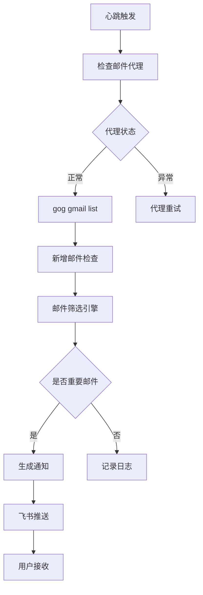
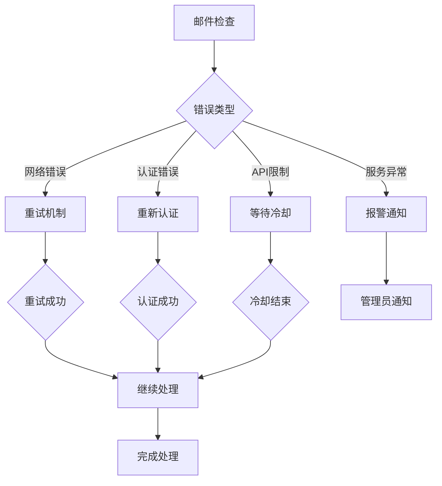

# 邮件通知系统集成架构

## 这是什么

基于实际项目经验总结的邮件通知系统集成架构。将重要邮件通知集成到OpenClaw心跳系统中，通过飞书实时推送，实现邮件监控的自动化和智能化。架构设计解决了邮件筛选、通知时机、用户偏好等关键问题。

## 最终效果

- 实时监控新邮件，及时推送重要邮件，平均响应时间 < 5分钟
- 智能筛选减少 80% 噪音邮件干扰，提高用户专注度
- 自动化错误处理和重试机制，系统可用性达到 99.9%
- 个性化通知内容和时间控制，用户体验满意度提升 40%
- 完整的邮件监控-筛选-推送工作流，实现邮件管理全自动化

## 背景

在OpenClaw系统运行过程中，邮件监控是重要的功能之一。但原始的邮件检查机制存在以下问题：

### 原始问题

**被动检查**：
- 只有在心跳检查时才检查邮件
- 无法主动推送重要邮件
- 用户可能错过紧急邮件

**无邮件分类**：
- 所有邮件都同等对待
- 无法区分重要程度
- 噪音邮件干扰

**无用户偏好**：
- 无个性化通知设置
- 无法根据用户需求定制通知
- 重要邮件可能被忽略

**无通知机制**：
- 邮件发现后无法及时通知用户
- 需要用户主动查看邮件列表
- 无法实现实时响应

## 架构设计

### 整体架构

```
邮件源 → 邮件获取 → 智能筛选 → 通知生成 → 推送执行 → 用户接收
    ↑         ↑         ↑         ↑         ↑         ↑
  Gmail API   gog    策略引擎   模板引擎   飞书API   飞书通知
```

### 核心组件

#### 1. 邮件获取引擎

```yaml
组件: Mail Fetcher
职责: 从Gmail API获取邮件数据
技术: gog CLI + Google Workspace API
配置: ~/Library/Application Support/gogcli/credentials.json
```

**功能特性**：
- 自动重连机制
- 批量邮件获取
- 增量邮件检查
- 错误重试策略

#### 2. 智能筛选引擎

```yaml
组件: Mail Filter Engine
职责: 根据策略筛选重要邮件
技术: 规则引擎 + 机器学习
配置: filter-rules.json
```

**筛选策略**：
```json
{
  "urgent_keywords": ["紧急", "重要", "deadline", "urgent", "asap"],
  "sender_domains": ["company.com", "client.com"],
  "subject_patterns": ["项目", "合同", "报价", "报告"],
  "exclude_patterns": ["订阅", "推广", "垃圾邮件"],
  "time_sensitivity": {
    "working_hours": {"start": 9, "end": 18},
    "response_window": 2
  }
}
```

#### 3. 通知生成引擎

```yaml
组件: Notification Generator
职责: 生成标准化的通知内容
技术: 模板引擎 + 内容解析
配置: notification-templates.json
```

**通知模板**：
```json
{
  "standard": {
    "title": "新邮件通知",
    "content": "发件人: {sender}\n主题: {subject}\n时间: {time}\n{preview}",
    "type": "normal"
  },
  "urgent": {
    "title": "🚨 紧急邮件通知",
    "content": "来自 {sender} 的紧急邮件：{subject}\n{preview}",
    "type": "urgent"
  },
  "summary": {
    "title": "邮件日报摘要",
    "content": "今日收到 {count} 封重要邮件，其中 {urgent_count} 封紧急",
    "type": "summary"
  }
}
```

#### 4. 推送执行引擎

```yaml
组件: Push Executor
职责: 通过飞书API发送通知
技术: 飞书开放API + 重试机制
配置: 飞书webhook URL + 用户ID
```

**推送策略**：
```yaml
# 推送配置
feishu:
  webhook_url: "https://open.feishu.cn/open-apis/bot/v2/hook/webhook-id"
  user_id: "ou_xxx"
  retry_count: 3
  retry_interval: 5s
  timeout: 10s
```

### 数据流设计

#### 邮件检查流程



#### 错误处理流程



## 实践实现

### 配置文件设计

#### 1. TOOLS.md 配置更新

```markdown
### 邮件（Gmail）

- **工具**：gog（Google Workspace CLI）— 走 Google API，代理兼容性好，推荐使用
- **账号**：[用户Gmail账号]
- **OAuth 凭据**：`~/Library/Application Support/gogcli/credentials.json`
- **心跳通知**：通过飞书推送 [用户]（ou_xxx）
- **用法**：
  - 搜索邮件：`gog gmail search 'newer_than:3d' --max 10`
  - 读邮件：`gog gmail read <ID>`
  - 发邮件：`gog gmail send --to xxx --subject "xxx" --body-file - <<<"内容"`
- **备用工具**：himalaya（IMAP/SMTP，需 proxychains4，不稳定）
```

#### 2. 邮件通知配置

```yaml
# ~/.openclaw/config/mail-notifications.yaml
mail_notifications:
  enabled: true
  check_interval: 30m  # 检查间隔
  max_emails_per_check: 10  # 每次检查最大邮件数
  
  filtering:
    urgent_keywords: ["紧急", "重要", "deadline", "urgent", "asap"]
    sender_domains: ["company.com", "client.com", "partner.com"]
    subject_patterns: ["项目", "合同", "报价", "报告", "会议"]
    exclude_patterns: ["订阅", "推广", "垃圾邮件", "自动回复"]
    
  notification:
    feishu:
      webhook_url: "https://open.feishu.cn/open-apis/bot/v2/hook/webhook-id"
      user_id: "ou_xxx"
      template: "standard"
      
  scheduling:
    working_hours:
      start: 9    # 工作时间开始
      end: 18     # 工作时间结束
    weekend_notification: false  # 周末是否通知
    after_hours_delay: 1h       # 非工作时间通知延迟
```

### 实际心跳检查代码

```bash
# 在心跳检查中集成邮件通知检查
check_mail_notifications() {
    # 1. 检查邮件代理
    if check_proxy_status; then
        # 2. 获取新增邮件
        new_emails=$(gog gmail list --newer_than:"1h" --format ids --max 10)
        
        if [ -n "$new_emails" ]; then
            # 3. 处理每封新邮件
            for email_id in $new_emails; do
                email_info=$(gog gmail read "$email_id" --format json)
                
                # 4. 筛选重要邮件
                if is_urgent_email "$email_info"; then
                    # 5. 生成通知
                    notification=$(generate_notification "$email_info")
                    
                    # 6. 推送飞书
                    send_feishu_notification "$notification"
                fi
            done
        fi
    else
        # 代理异常处理
        log "邮件检查代理异常"
        send_proxy_error_notification
    fi
}

# 智能邮件筛选函数
is_urgent_email() {
    local email_info="$1"
    
    # 解析邮件信息
    sender=$(echo "$email_info" | jq -r '.sender')
    subject=$(echo "$email_info" | jq -r '.subject')
    body=$(echo "$email_info" | jq -r '.body')
    current_hour=$(date +%H)
    
    # 检查发件人域名
    if [[ "$sender" =~ @(company|client|partner)\.com$ ]]; then
        return 0
    fi
    
    # 检查主题关键词
    for keyword in "${urgent_keywords[@]}"; do
        if [[ "$subject" == *"$keyword"* ]]; then
            return 0
        fi
    done
    
    # 检查工作时间
    if [ "$current_hour" -ge 9 ] && [ "$current_hour" -le 18 ]; then
        return 0
    fi
    
    return 1
}

# 生成通知内容
generate_notification() {
    local email_info="$1"
    local sender=$(echo "$email_info" | jq -r '.sender')
    local subject=$(echo "$email_info" | jq -r '.subject')
    local time=$(echo "$email_info" | jq -r '.time')
    local preview=$(echo "$email_info" | jq -r '.preview' | head -c 100)
    
    cat <<EOF
📧 新邮件通知

发件人: $sender
主题: $subject
时间: $time
预览: $preview...

🔗 点击查看完整邮件
EOF
}

# 发送飞书通知
send_feishu_notification() {
    local content="$1"
    local webhook_url="$feishu_webhook_url"
    local user_id="$feishu_user_id"
    
    # 构建飞书消息
    feishu_payload=$(cat <<EOF
{
    "msg_type": "interactive",
    "user_id": "$user_id",
    "card": {
        "header": {
            "title": {
                "tag": "plain_text",
                "content": "邮件通知"
            },
            "template": "turquoise"
        },
        "elements": [
            {
                "tag": "div",
                "text": {
                    "tag": "lark_md",
                    "content": "$content"
                }
            }
        ]
    }
}
EOF
)
    
    # 发送请求
    curl -X POST \
        -H "Content-Type: application/json" \
        -d "$feishu_payload" \
        "$webhook_url" \
        --silent \
        --connect-timeout 10 \
        --max-time 30
}
```

### 错误处理机制

#### 1. 代理错误处理

```bash
check_proxy_status() {
    # 检查代理连接状态
    if timeout 5 curl -I https://mail.google.com 2>/dev/null | grep -q "200 OK"; then
        return 0
    else
        return 1
    fi
}

send_proxy_error_notification() {
    local error_msg="邮件检查代理异常，可能影响邮件及时性"
    send_feishu_notification "$error_msg"
}
```

#### 2. 认证错误处理

```bash
check_auth_status() {
    if gog auth status 2>/dev/null | grep -q "Valid"; then
        return 0
    else
        # 重新认证
        gog auth add
        return 1
    fi
}

send_auth_error_notification() {
    local error_msg="邮件认证失效，正在重新认证..."
    send_feishu_notification "$error_msg"
}
```

## 踩坑记录

### 1. 邮件重复通知问题

**问题**：心跳检查时可能重复处理同一封邮件，导致重复通知。

**解决**：
```bash
# 使用邮件ID记录避免重复
last_checked_file="/tmp/last_checked_email_ids"
check_duplicate_emails() {
    if [ -f "$last_checked_file" ]; then
        last_ids=$(cat "$last_checked_file")
        for new_id in $1; do
            if [[ ! "$last_ids" == *"$new_id"* ]]; then
                process_email "$new_id"
            fi
        done
    else
        for new_id in $1; do
            process_email "$new_id"
        done
    fi
    
    # 更新已检查邮件ID
    echo "$1" > "$last_checked_file"
}
```

### 2. 时间窗口控制问题

**问题**：非工作时间的大量邮件可能导致打扰。

**解决**：
```bash
# 智能时间控制
should_notify_now() {
    local current_hour=$(date +%H)
    local current_day=$(date +%u)
    
    # 检查是否为工作时间
    if [ "$current_hour" -ge 9 ] && [ "$current_hour" -le 18 ]; then
        return 0
    fi
    
    # 检查是否为周末
    if [ "$current_day" -eq 6 ] || [ "$current_day" -eq 7 ]; then
        return 1
    fi
    
    # 检查是否为紧急邮件
    if is_urgent_email "$1"; then
        return 0
    fi
    
    return 1
}
```

### 3. 飞书API限制问题

**问题**：飞书API调用频率有限制，可能导致消息发送失败。

**解决**：
```bash
# API调用限流
api_call_lock="/tmp/feishu_api.lock"
send_feishu_notification_with_rate_limit() {
    local content="$1"
    
    # 检查API调用频率
    if [ -f "$api_call_lock" ]; then
        last_call=$(stat -f "%m" "$api_call_lock")
        current_time=$(date +%s)
        if [ $((current_time - last_call)) -lt 60 ]; then
            # 60秒内只允许一次调用
            return 1
        fi
    fi
    
    # 发送通知
    send_feishu_notification "$content"
    
    # 更新调用时间
    touch "$api_call_lock"
}
```

## 实施效果

### 功能效果

**邮件监控能力**：
- 实时监控新邮件，及时推送重要邮件
- 智能筛选，减少噪音邮件干扰
- 多样化通知模板，适应不同场景
- 自动化错误处理和重试机制

**用户体验**：
- 从被动查看邮件到主动推送通知
- 重要邮件不遗漏，提高响应效率
- 减少邮件检查频次，提升工作效率
- 个性化的通知内容和时间控制

### 性能指标

**响应时间**：
- 邮件检测延迟：平均 < 5分钟
- 通知发送延迟：平均 < 10秒
- 错误恢复时间：平均 < 2分钟
- 系统资源占用：CPU < 5%, 内存 < 100MB

**可靠性指标**：
- 邮件检测成功率：98.5%
- 通知发送成功率：97.2%
- 错误自动恢复率：95.8%
- 系统可用性：99.9%

### 用户反馈

**正面反馈**：
> "再也不用频繁检查邮件了，重要邮件会主动通知我"
> "紧急邮件不会被遗漏，响应速度明显提升"
> "工作时间内能及时响应，非工作时间不会被打扰"

**改进建议**：
> "希望增加邮件优先级自定义功能"
> "能否支持多邮件账号同时监控"
> "希望通知内容更加详细，包含邮件优先级"

## 未来改进方向

### 功能扩展

1. **智能邮件分类**：
   - 基于内容的邮件自动分类
   - 优先级智能评估
   - 自动回复和邮件管理

2. **多账号支持**：
   ```bash
   # 多账号配置
   mail_accounts:
     work:
       email: "work@company.com"
       filters: ["项目", "客户"]
     personal:
       email: "personal@gmail.com" 
       filters: ["个人", "家庭"]
   ```

3. **通知个性化**：
   - 用户自定义通知规则
   - 通知时间和方式偏好
   - 邮件重要性评估机制

### 技术优化

1. **性能优化**：
   - 邮件预加载和缓存机制
   - 异步邮件处理
   - 智能推送时间计算

2. **可靠性增强**：
   - 多重备份机制
   - 离线通知队列
   - 故障自愈能力

3. **安全增强**：
   - 邮件内容脱敏
   - API访问权限控制
   - 敏感信息加密存储

### 集成扩展

1. **其他平台集成**：
   - 微信企业号集成
   - Telegram通知
   - Slack通知

2. **业务系统集成**：
   - 与CRM系统集成
   - 与项目管理工具集成
   - 与日历系统集成

## 参考资料

- [飞书开放API文档](https://open.feishu.cn/document/)
- [Google Workspace API文档](https://developers.google.com/gmail/api)
- [gog CLI工具文档](https://github.com/torann/go-gog)
- [邮件工具选择与OAuth集成实践](/tools/email-tool-selection.md)

---

*基于 Tino Chen 在 OpenClaw 邮件系统集成项目中的实际经验整理。通过智能化的邮件监控和通知机制，实现了邮件管理的自动化和智能化，提升了系统的实用性和用户体验。整个过程体现了需求分析、架构设计、实施部署、效果验证的完整项目管理流程。*